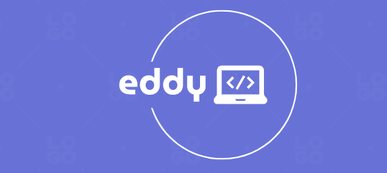

<div align="center">

  
  <br/>
</div>

# To-do-list
The app which displays the list of tasks added by the user! a user can be able to add or delete todo, and mark some todos as completed!

<a name="readme-top"></a>


<!-- TABLE OF CONTENTS -->

# 📗 Table of Contents

- [📖 About the Project](#about-project)
  - [🛠 Built With](#built-with)
    - [Key Features](#key-features)
  - [🚀 Live Demo](#live-demo)
- [💻 Getting Started](#getting-started)
  - [Setup](#setup)
  - [Prerequisites](#prerequisites)
  - [Install](#install)
  - [Usage](#usage)
- [👥 Authors](#authors)
- [🔭 Future Features](#future-features)
- [🤝 Contributing](#contributing)
- [⭐️ Show your support](#support)
- [🙏 Acknowledgements](#acknowledgements)
- [❓ FAQ](#faq)
- [📝 License](#license)

<!-- PROJECT DESCRIPTION -->

# 📖 Awesome Books <a name="about-project"></a>

> This website has functionality to add and remove books from the list.

## 🛠 Built With <a name="built-with"></a>

>HTML
>Vanilla Javascript
>CSS
>Bootstrap

<!-- Features -->

### Key Features <a name="key-features"></a>


> Describe between 1-3 key features of the application.

- I used modern ES6
- Reliable
- Very Modern app


<p align="right">(<a href="#readme-top">back to top</a>)</p>

<!-- LIVE DEMO -->

## 🚀 Live Demo <a name="live-demo"></a>

> Add a link to your deployed project.

- [Live Demo Link](https://todo-app-c9sw.onrender.com/)

> ## Project demo
- [Check out the live video here](https://www.loom.com/share/639799d26fff459c97e0ff8ae6f395e4)

<p align="right">(<a href="#readme-top">back to top</a>)</p>

<!-- GETTING STARTED -->

## 💻 Getting Started <a name="getting-started"></a>

> To get a local copy up and running, follow these steps.

### Prerequisites

In order to run this project you need:

- Internet
- Node.js installed
- Code Editor or IDE
- Browser

### Setup


> Clone this repository to your desired folder: cd [folder] to navigate and run the below comand to clone the project

```sh
https://github.com/EddyShimwa/To-do-list.git
```

### Install

Install this project with:

- download npm the packages

```sh
npm install
```

To download the dev dependency you have to type this command:

```sh
npm i --save-dev
```

### Usage

> To see the project in your local browser first of all, go to project file and navigate the directory on your terminal and type below command:

```sh
npm start
```


<p align="right">(<a href="#readme-top">back to top</a>)</p>

<!-- AUTHORS -->

## 👥 Authors <a name="authors"></a>

> All of the collaborators of this project.

👤 Eddy Shimwa

- GitHub: [@EddyShimwa](https://github.com/EddyShimwa)
- Twitter: [@eddy56388406](https://twitter.com/eddy56388406)
- LinkedIn: [Pray Eddy SHIMWA](https://www.linkedin.com/in/pray-eddy-shimwa/)

<p align="right">(<a href="#readme-top">back to top</a>)</p>

<!-- FUTURE FEATURES -->

## 🔭 Future Features <a name="future-features"></a>

> Describe 1 - 3 features you will add to the project.
- I will use OOPS
- Modern Style Design
- I will add the image&icons to describe the todo

<p align="right">(<a href="#readme-top">back to top</a>)</p>

<!-- CONTRIBUTING -->

## 🤝 Contributing <a name="contributing"></a>

Contributions, issues, and feature requests are welcome!

<p align="right">(<a href="#readme-top">back to top</a>)</p>

<!-- SUPPORT -->

## ⭐️ Show your support <a name="support"></a>

> Give a star to show support.

<p align="right">(<a href="#readme-top">back to top</a>)</p>

<!-- ACKNOWLEDGEMENTS -->

## 🙏 Acknowledgments <a name="acknowledgements"></a>

> I would like to thank...
- Microverse for the greatest opportunity they provide to learn
- Google
- Stackoverflow

<p align="right">(<a href="#readme-top">back to top</a>)</p>

<!-- LICENSE -->

## 📝 License <a name="license"></a>

This project is [MIT](./LICENSE) licensed.

<p align="right">(<a href="#readme-top">back to top</a>)</p>
